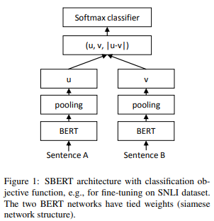

# SBERT summary
## SBERT로 해결한 문제와 원리

[SBERT](https://arxiv.org/pdf/1908.10084.pdf)는 기존의 BERT와 RoBERTa를 가지고 Semantic Textual Similarity와 같은 sentence-pair regression task의 computational overhead를 극복하기위해 ***siamese network*** 라는 특별한 network 구조를 가지고 학습하여 효율적인 Sentence Embedding을 할 수 있도록 만든 모델입니다.

기존의 BERT를 이용하여 두 문장의 Similarity를 구해야 할 경우 10000문장(n=10000)의 Similarity를 구하기 위해서는 10000문장의 combination(n=10000, n*(n-1)/2 =49995000)만큼의 inference를 해야하기 때문에 굉장히 overhead가 큽니다. V100 GPU 환경에서 이와 같이 BERT를 이용하여 10000문장에서 모든 문장간 Similarity를 구할경우 65시간정도가 걸리는데, SBERT를 이용하면 BERT를 이용하여 inference를 하는 정확도를 유지하면서 5초만에 모든 문장간 Similarity를 구할 수 있습니다.

기존의 BERT를 이용하여 Similarity를 구하는 경우 아래와 같이 두개의 Sentence를 BERT에 넣고 CLS토큰을 이용하여 Classification 하도록 fine-tuning 학습을 해서 이용하는게 가장 일반적으고 두개의 Sentence의 token들을 가지고 Max Pooling 혹은 Average Pooling을 이용하여 Classification 하도록 fine-tuning 학습하기도 합니다.

</img> 

BERT를 이용하는 경우에는 Sentence1과 Sentence2에 따라 CLS token의 값도 바뀌고 Sentence1의 token embedding들과 Senetence2의 token embedding들도 서로 영향을 받아 값이 항상 바뀌기 때문에 Similarity를 계산하기 위해서는 모든 조합을 inference해야 합니다. (모델 inference 횟수 = n*(n-1)/2 번)

**하지만 SBERT를 이용할경우에는 아래와 같이 하나의 sentence에 대하여 고정된 embedding을 생성할수 있기 때문에 문장들을 고정적으로 vector space에 맵핑하여 Similarity를 구할수 있기 때문에 속도가 빠릅니다. (모델 inference 횟수 = n번)** 

</img> 

**SBERT를 이용하여 sentence vector를 생성해 낼때에는 일반적으로 아래와 같이 세가지의 값중 하나를 이용합니다.**
* CLS token embedding의 값
* Sentence token embedding들의 Average Pooling 값
* Sentence token embedding들의 Max Pooling 값

**물론 기본 BERT에 sentence를 하나만 넣어서 위와같은 embedding 값을 생성해내도 고정된 sentence vector를 생성해 낼 수 있지만, 이 논문의 실험 결과에 따르면 결과가 매우 좋지 못하여 일반적인 word vector(GloVe)를 이용하여 생성해낸 embedding 값보다 성능이 좋지 못하였습니다.**

이 논문에서는 SBERT를 이용한 Sentence Embedding의 효율성을 여러 downstream task의 성능을 통하여 증명하였습니다.

------------------------------------------

## SBERT Training
SBERT는 아래의 그림(Figure 1)과 같이 2개의 BERT를 ***siamese network structure***라는 새로운 방식으로 구성하여 SNLI dataset으로 Fine-tuning을 한 모델입니다. **여기서 중요한 점이 siamese network structure는 2개의 BERT가 weight를 공유한다는 것 입니다. 즉 실제로는 하나의 BERT를 가지고 2개의 Sentence에 대한 Sentence vector를 생성해 냅니다.**

</img> 

2개의 BERT에 각각 Sentence A와 Sentence B를 input으로 CLS토큰과 Sentence token embedding을 생성하고 위에서 설명한 세가지 방법(CLS, Token average pooling, Token max pooling)중 하나를 적용하여 각각 Sentence vector인 u와 v를 생성해냅니다. 그 이후 v값과 u값, 그리고 v와 u의 element wise difference인 |u-v| 세가지의 값을 concatenation하여 SNLI task의 Softmax classifier의 input으로 넣어 학습합니다. 이러한 siamese network structure를 이용하여 SNLI task를 이용하여 Fine-tuning한 BERT모델이 SBERT모델이 됩니다. **이러한 SBERT 모델을 이용하여 단일 Sentence에 대한 embedding을 생성할 경우 BERT보다 훨씬 더 유의미한 embedding값을 뽑아 낼 수 있게 됩니다.** 이것을 이 논문에서는 downstream task에 성능비교를 통하여 증명하였습니다.

https://arxiv.org/pdf/1908.10084.pdf

-----------------------------------

Universial Sentence Encoder와 같이 Sentence의 embedding을 생성하는 강력한 방법 중 하나로 여러 NLP task에 적용할 수 있다.